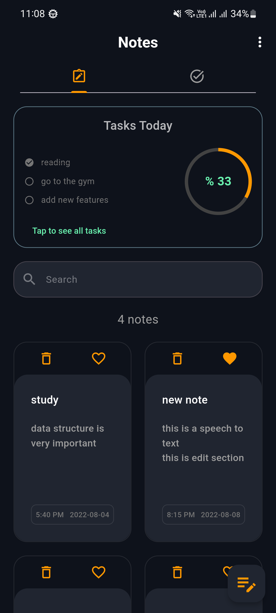
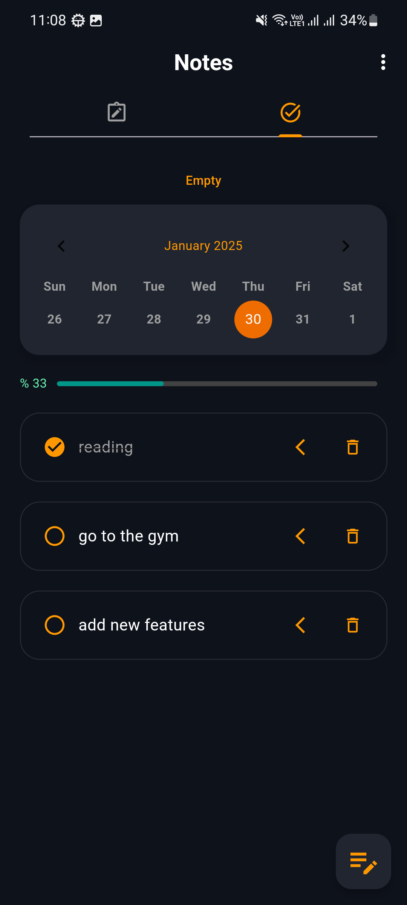
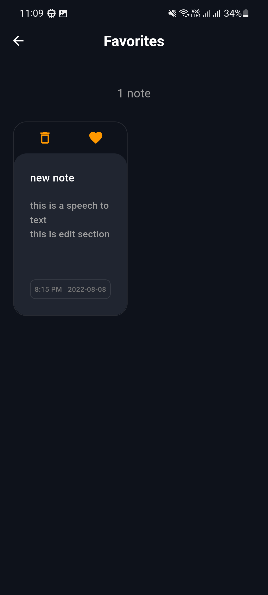
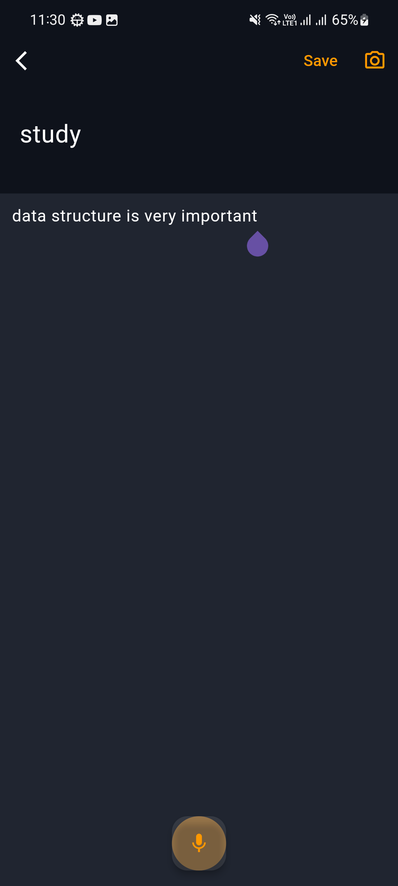

# 📝 Notes

**Notes App** is a Flutter application designed to help you manage your daily life efficiently. With this app, you can take notes by typing or using speech-to-text functionality, track your daily tasks, and monitor your progress, all in a beautiful and user-friendly interface.

---

## 🚀 Features
- 🖋️ **Write Notes**: Create and organize notes easily by typing them.
- 🎙️ **Speech-to-Text**: Convert your speech into written words for faster note-taking.
- ✅ **Daily Task Management**: Add, edit, and track your daily tasks with a clean and intuitive layout.
- 📊 **Progress Tracking**: Monitor your productivity and daily accomplishments.
- 🎨 **Pretty UI**: Enjoy a visually pleasing and user-friendly interface.

---

## 📸 Screenshots

  
  

  
  

---

## 🛠️ Technologies Used
- **Flutter**: For building a cross-platform application.
- **SQLite**: For efficient local data storage (e.g., notes and tasks).
- **BLoC**: For state management to ensure smooth app performance.

---
## 👤 Author
- **Name**: Mohamed Fayez
- **Email**: [Mohfayez2412@gmail.com](mailto:Mohfayez2412@gmail.com)
- **GitHub**: [https://github.com/MohamedFayez20](https://github.com/MohamedFayez20)

